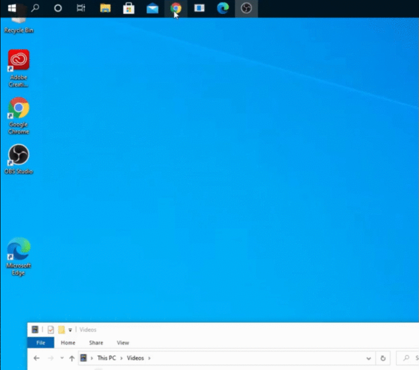
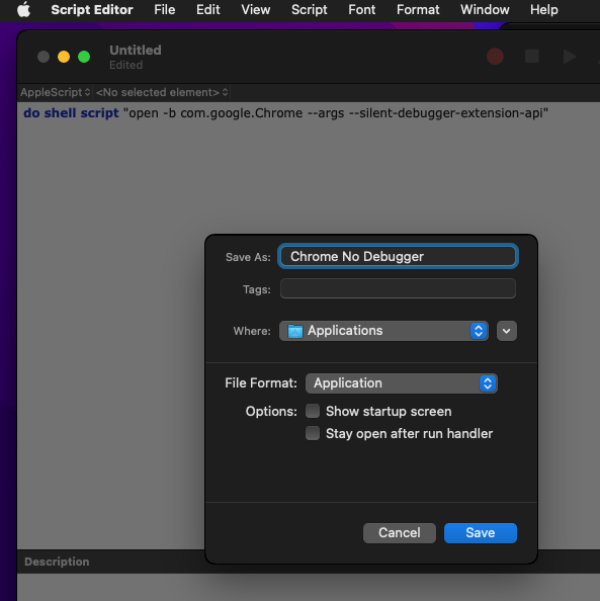

# Hiding the "LipSurf started debugging this browser" Message

Chrome shows "'LipSurf - Voice Control for the Web' started debugging this browser" in a message bar because LipSurf needs to emulate the keyboard and mouse in some cases. You can configure Chrome to hide the bar if it bothers you:

## Windows



1. Right click the icon from where you launch Chrome - whether it be the task bar, Desktop, or the programs menu 
(you will need to follow these instructions for each shortcut you use).

2. Click properties

3. Add `--silent-debugger-extension-api` after `.../chrome.exe" ` (**Make sure it's after the closing quote**)

4. Repeat for other Chrome shortcuts you use.

5. Exit Chrome and launch it from one of the launchers you changed.


## Mac

1. Open Script Editor (In Applications -> Utilities)

2. Paste the following:

```
do shell script "open -b com.google.Chrome --args --silent-debugger-extension-api"
```

3. Save it with the name "Chrome No Debugger" in Applications and file format **Application**.



4. Exit Chrome if it's open.

5. Go to Applications to launch "Chrome No Debugger"

::: warning NOTE
You should remove the old Chrome shortcut from your Dock and only use this new one to open Chrome from now on.
:::


## Linux (Ubuntu)

1. Open a terminal and copy the google-chrome.desktop file to your $XDG_DATA_HOME folder:

   `cp /usr/share/applications/google-chrome.desktop ~/.local/share/applications`
  
2. You need to modify the new google-chrome.desktop file, not the one located in /usr/share/applications/ as that one will be overwritten by package upgrades or release updates.

Edit all Exec= commands to append the `--silent-debugger-extension-api` option.

::: warning NOTE
You may have to unlock the icon from the launcher and lock it again to select the right .desktop file tough.
:::