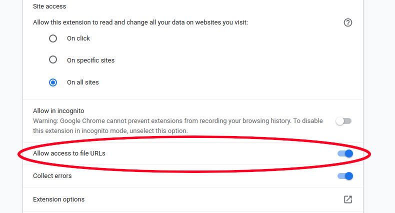

# Not Working on Local Files (e.g. locally saved PDFs)

To use LipSurf on a locally saved file (PDF or html), you first must grant an additional permission.
Basic LipSurf commands will work on PDFs (e.g. zoom in, scroll down etc.) but it's common for PDFs to be saved
locally, so you may need to take these additional steps.

#### Steps

1. Go to `chrome://extensions` in your address bar.

2. Click "details" under LipSurf.

3. Enable "Allow access to file URLs".

